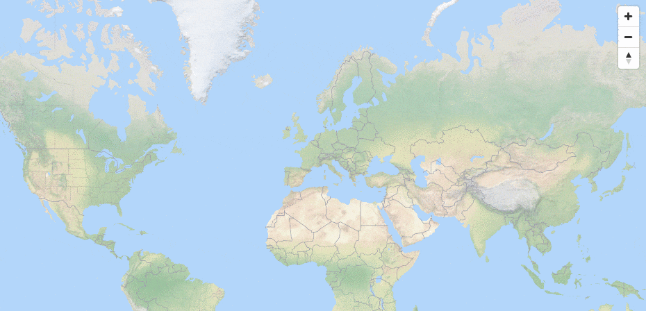
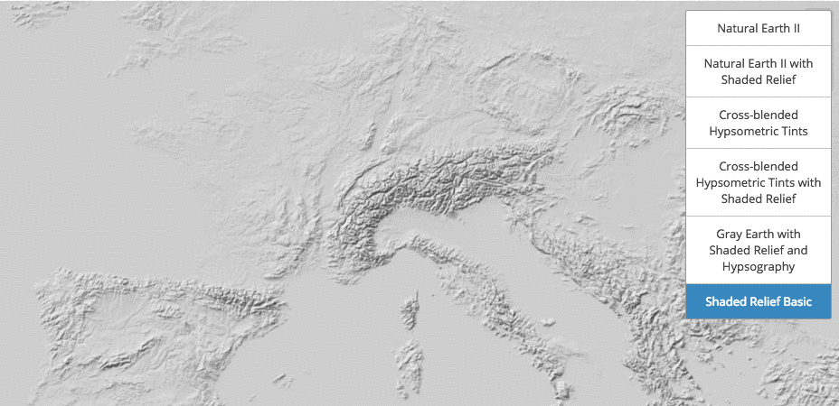

# Natural Earth Vector and Raster Tiles [](https://github.com/lukasmartinelli/naturalearthtiles#license) [](https://travis-ci.org/lukasmartinelli/naturalearthtiles)

[**naturalearthtiles.org**](http://naturalearthtiles.org/) provides prerendered vector and raster tiles for [Natural Earth](http://naturalearthdata.com/).

The vector tiles are encoded in the [Mapbox vector tile specification](https://github.com/mapbox/vector-tile-spec) for use with Mapbox GL or other clients and consist of carefully curated layers from the cultural and physical data sets.

The raster tiles are made from the [Natural Earth Raster TIF files](http://www.naturalearthdata.com/downloads/10m-raster-data/)
and are ideal as base layer or shading for your base maps.

[**:globe_with_meridians: Check the demo at naturalearthtiles.org**](http://naturalearthtiles.org)

[**:open_file_folder: Download the vector and raster tiles from the releases page**](https://github.com/lukasmartinelli/natural-earth-vector-tiles/releases/latest).




For high zoom level vector tiles please checkout our project to [create vector tiles from Open Street Map](http://osm2vectortiles.org).

## Use Vector Tiles

You can use [**mbview**](https://github.com/mapbox/mbview) to take a look at the MBTiles vector tiles locally.
To display the vector tiles with Mapbox GL you need a tileserver.

Tileservers:
- [tessera](https://github.com/mojodna/tessera)
- [tileserver-gl-light](https://github.com/osm2vectortiles/tileserver-gl-light)
- [tileserver-gl](https://github.com/klokantech/tileserver-gl)

## Run Workflow

The entire project is structured components using Docker containers
to work together. Ensure you meet the prerequisites.

- Install [Docker](https://docs.docker.com/engine/installation/)
- Install [Docker Compose](https://docs.docker.com/compose/install/)

By default you will use the containers published to [DockerHub](https://hub.docker.com/u/naturalearthtiles/).
You can also build the containers yourself with `make`.
Start up the PostgreSQL database with the PostGIS extension.

```bash
docker-compose up -d postgres
```

Now import the Natural Earth data set (can take several minutes).

```bash
docker-compose run import-naturalearth
```

Import the required database schema (views, prepared tables and helper functions).

```bash
docker-compose run db-schema
```

Export the vector tiles for the planet (can take up to 15min).
The exported vector tiles are stored in `data/natural_earth.mbtiles`.

```bash
docker-compose run export-vectortiles
```

To visualize and work with the vector tiles you can spin up Mapbox Studio
in a Docker container and visit `localhost:3000`.

```bash
docker-compose up mapbox-studio
```

The raster tiles are exported directly from Mapbox Studio from the `raster-datasource`. This process is not automated yet.

## License

The produced vector and raster tiles are made available under the Public Domain Dedication and License v1.0 whose full text can be found at: http://www.opendatacommons.org/licenses/pddl/1.0/.

The source code is Copyright (c) Lukas Martinelli under BSD-3 as defined in [License](LICENSE). The vector data source in `src/vector-data-source` is partially derived from [mapbox/natural-earth-tm2](https://github.com/mapbox/natural-earth-tm2) and therefore retains Copyright (c) Mapbox under BSD-3 as defined in [License](src/vector-data-source/LICENSE.md).
